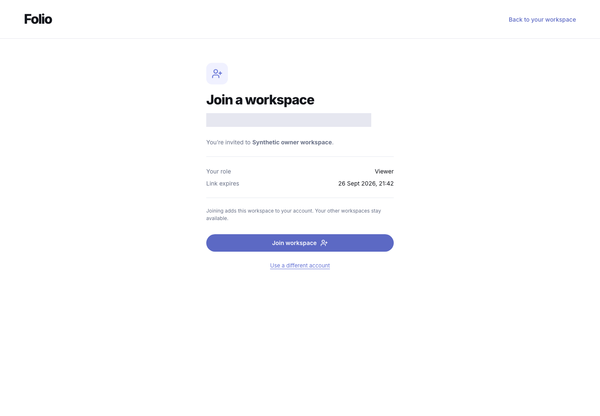
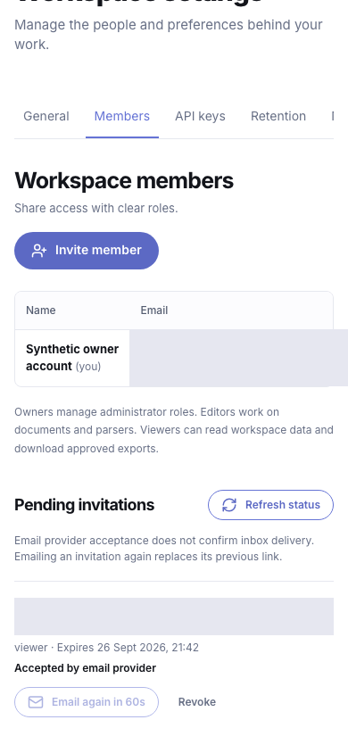
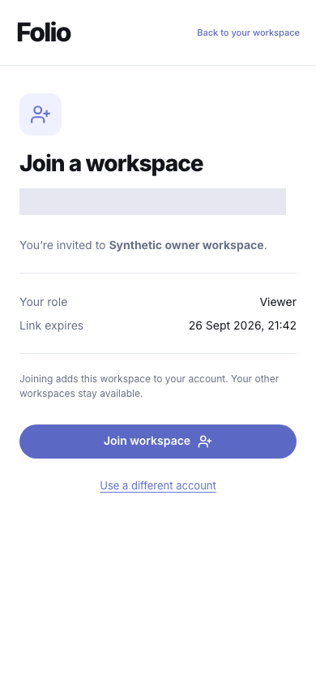
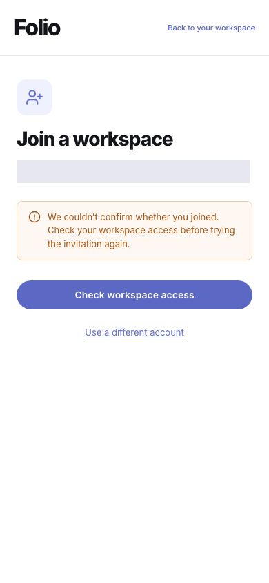

# Workspace invitation email

This increment closes the manual-only invitation delivery gap in W07. Local acceptance passed; hosted migration and actual inbox delivery are separate release gates.

## Owner and administrator workflow

Members settings offers two explicit choices: queue an invitation email, or create a link to share manually. Email is enabled only after a successful availability check. Manual sharing returns a one-time link and does not send a message. A configured sender is required for email; unavailability never silently changes the selected delivery method.

Pending invitations show the role, expiry and email state. Queued, sending, failed and provider-accepted states describe the durable operation. Provider acceptance does not prove inbox delivery. Status refresh is available, with automatic polling while mail is queued or sending. A lost creation or resend response requires an explicit successful refresh before another attempt.

Emailing an invitation again replaces its token and queues a new message. The previous link and pending message are invalidated. Old manually revealed links are removed from the screen when replaced or revoked. Owners can invite administrators; administrators can invite editors or viewers. Invitation management requires an authenticated browser session and current workspace management permissions.

## Recipient workflow

New links use `/invite#token=…`. The application captures the token before router initialization, removes it from browser history and keeps it only in tab memory. Legacy `/app/invite?token=…` links are cleaned on arrival. Invitation, reset and verification tokens have separate memory slots. Tokens are not copied into sign-in continuation URLs, browser storage, cached queries or hidden form controls. A reload needs the original invitation.

Existing users sign in with the intended email address in the same tab. New users complete account creation and any required email verification, then reopen the invitation. Opening a link does not accept it. After authentication, the intended recipient sees the workspace, effective role and expiry before choosing **Join workspace**. Existing membership roles are preserved. A successful join offers **Open workspace**. An uncertain response offers a workspace-access check instead of automatically repeating acceptance.

The server checks the intended email address and current invitation validity. It rechecks expiry using the database clock after lock waits and membership insertion. Expired, consumed, revoked and replaced tokens cannot create membership. Current issuer permissions are also checked; older manual invitations retain their existing issuer-less compatibility.

## Durable delivery

Invitation recipients need not have a Folio account. A separate `invitation_email_outbox` binds messages to the workspace and invitation, with a composite foreign key. It shares the existing authentication-email transport without weakening the user-bound recovery and verification outbox or manufacturing accounts.

Invitation, encrypted message and audit are committed atomically. Token hashes bind queued messages to the invitation revision. Admission allows at most 100 active pending invitations per workspace, 5,000 pending/sending emails globally, and five invitation emails per recipient per hour with a 60-second cooldown. Workers use finite leases, stable per-message provider idempotency, bounded retries and deadlines. Failed attempts retain only finite error codes. Terminal messages erase ciphertext. Resend, acceptance and revocation prevent a late provider acknowledgement from reactivating old work. A message already in flight may still reach the provider after revocation; its link remains invalid.

Local and hosted email workers alternate account and invitation work, isolating a failing lane so the other can progress. Cleanup still runs when sending is unavailable. New queue and rate-limit tables are backend-only, with forced row-level security and explicit revocation of tenant-role privileges.

## Release boundaries

Migration `030_invitation_email.sql` and a matching runtime are required. Hosted migrations 021–030 and real authentication-email sender/inbox acceptance remain pending. The current increment uses owned local fixtures and controlled senders. Free plans and visibly mocked billing remain unchanged. Existing dated verification evidence and all 47 original capability criteria remain preserved.

## Acceptance

W07 invitation email is implemented and locally verified with controlled senders. Owners and administrators can explicitly queue email or create a manual link, inspect delivery status, resend with token rotation, and revoke invitations. The recipient reviews the workspace and role after normal sign-in; new accounts complete required email verification before joining. Expiry, role preservation, delayed responses, lost responses and mobile layout are covered. **536/536 serial tests** passed on **Node 24.13.0** in **139.208 seconds**, with no failures or skips. Build, hosted packaging and isolated runtime/decoder checks passed on the same **246 source files**, fingerprint **`5e0b5fba4dfc5b0eaf14cafe0b8abce57c5e287ec4d06c3a210546167ef51778`**. **13/13 desktop/mobile browser groups** passed; six invitation and one verification email were captured locally, zero real provider calls occurred, and all 13 owned accounts/workspaces were cleaned while preservation checks passed. Migration **030 is local only**, with 21 local migrations; hosted **021–030** and actual authentication sender/inbox acceptance remain pending. Free plans and mocked billing are unchanged. All 47 original capability criteria remain preserved.

[Dated acceptance receipt](evidence/invitation-email-2026-09-19/verification.json) and [source manifest](evidence/invitation-email-2026-09-19/source-manifest.json) identify the validated source.

