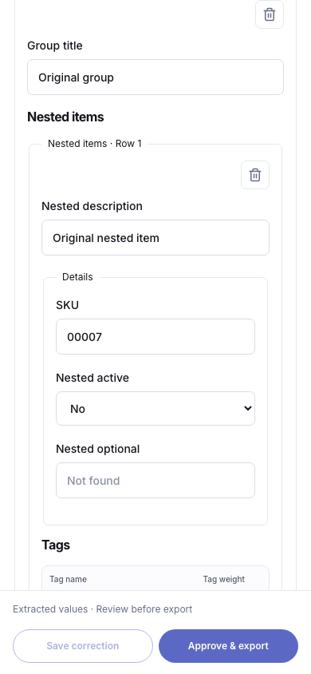
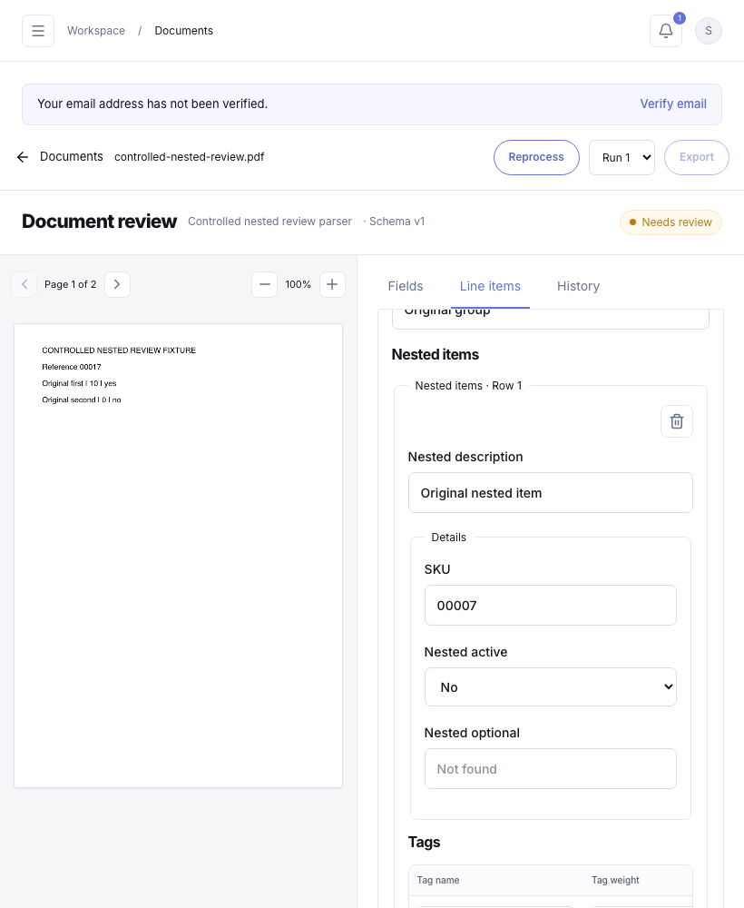
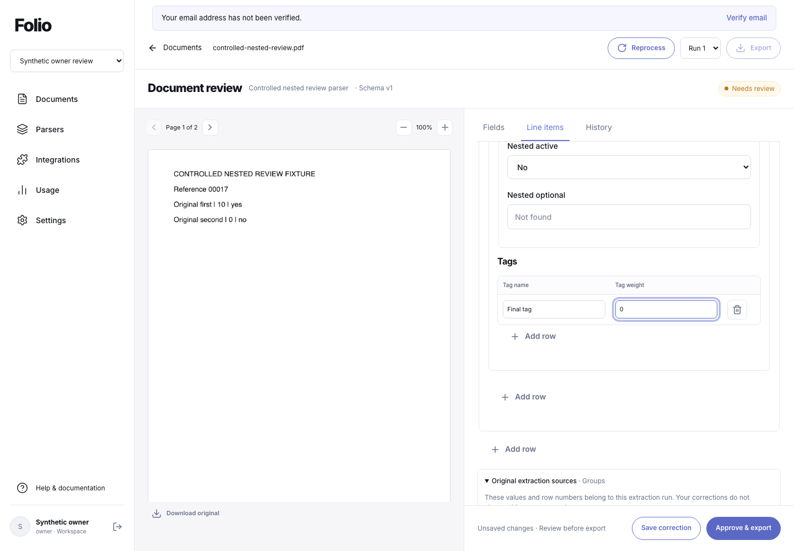
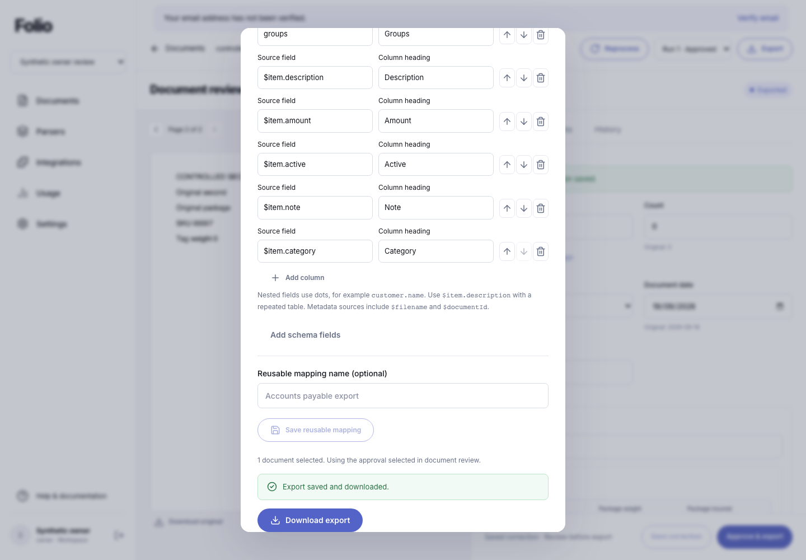

# Nested review, structural edits and approved exports

Recorded 19 September 2026. This increment completes targeted implementation and verification work for the existing nested review workflow. The final controlled browser, full regression suite, build and package checks passed on the source identified below. Isolated component checks remain a separate evidence layer.

The original requirements are the [BUILD-BRIEF extraction, review and export workflow](../BUILD-BRIEF.md#feature-parity-inventory) and its [desktop, tablet and mobile verification requirements](../BUILD-BRIEF.md#execution-milestones-and-verification). The applicable matrix rows are [R03 review and R01 validation](PARITY-MATRIX.md#review-normalization-and-validation), [X05 provenance](PARITY-MATRIX.md#extraction-schema-and-templates), and [E01 downloads and E02 mappings](PARITY-MATRIX.md#exports-api-and-integrations). This record does not extend the supported schema or export model.

## Editing and recovery contract

[ValueEditor.tsx](../src/features/documents/ValueEditor.tsx) renders the selected run's schema recursively, up to the existing four-level limit. Objects remain labelled groups; arrays with scalar columns remain tables; rows containing objects or arrays use nested groups. Add row creates child values from the schema's defaults, empty arrays/objects, and missing scalar values. Remove row changes the editable values only. An empty array retains its Add row control and an explicit empty state.

Add and Remove controls identify the full containing field and row path. Adding a row moves focus into the new row; removing a row moves focus into the next surviving row, or the previous row when the last row is removed. If an array becomes empty, focus moves to its Add row control. A newly created row whose children contain only empty nested arrays can focus a nested Add row control. Required scalar controls expose `aria-required`; the server remains responsible for approval validation.

[review.css](../src/features/documents/review.css) allows nested fieldsets and grid tracks to shrink within the review pane. A wide scalar table can scroll within its own wrapper, without forcing the entire nested form to overflow. This retains the table layout and does not promise that every table fits without local scrolling.

[value-editing.ts](../src/features/documents/value-editing.ts) keeps numeric drafts editable as text and normalizes valid finite numeric text at the save boundary. Missing values, zero, false, identifiers with leading zeros, and arrays retain their distinct meanings. A saved correction is separate from approval; saving an invalid draft does not make it approved.

[Review.tsx](../src/features/documents/Review.tsx) compares the draft's baseline revision with the current selected run. A newer correction does not overwrite a dirty draft. Save and Approve remain disabled until the user loads the latest values. The recovery action remains visible if the user manually reverts the draft to its old baseline: it changes from **Discard draft & load latest** to **Load latest values**. This removes the prior state in which both approval and recovery were unavailable.

Review state is scoped to the document, account and workspace; the editable pane is also scoped to the selected run and editing permission. Leaving that scope invalidates the pane's continuation: a late correction response cannot start approval, and a late approval response cannot open an export dialog for the replacement review. Requests already received by the server may still complete for their original document; leaving the page does not undo an authorized saved correction or approval.

## Approval identity and export behavior

**Approve & export** saves a dirty correction first, approves the resulting revision, and passes the returned approval ID into [ExportDialog.tsx](../src/features/documents/ExportDialog.tsx). The dialog retains that document/approval pair. A newer correction, approval or extraction result cannot silently substitute different values when the user downloads from that dialog. Its copy states that it uses the approval selected in document review.

The separate document-toolbar **Export** action keeps the existing behavior: the export API selects the current approved revision when the export is requested. It is not a promise to export an unapproved selected extraction run.

[The export API](../server/integrations/exports.ts) resolves an explicit approval against both its document and workspace. Every exported document needs a matching approval selection when explicit revisions are supplied. JSON includes approved values and revision metadata; CSV and XLSX use the same saved approval values through the existing column and row mapping rules. Saved export snapshots retain their own bytes and approval metadata.

The dialog prevents duplicate submission while exporting. Closing or replacing its export scope cancels the client continuation and prevents a late response from initiating a download in the replacement dialog. The download path must match the export ID returned by the same-origin API, and the download uses the selected workspace. A cancelled client request can still leave an export snapshot if the server already committed it; client cancellation does not assert rollback.

## Validation and supported export paths

[schema.ts](../server/core/schema.ts) now checks undeclared keys recursively through schema objects and array rows. [The correction route](../server/core/document-routes.ts) rejects unknown fields before writing a correction, including fields hidden inside nested rows. Approval validation also reports unknown fields, alongside existing required, type, date, choice and applicable total checks. Only own properties of plain records are treated as field values. This does not retroactively rewrite historical approvals or original extraction records.

The existing schema limit is four levels, with keys of at most 64 characters. [export-contract.ts](../shared/export-contract.ts) aligns browser controls, saved mapping input and export request limits with that contract: a dotted field path can contain up to **259 characters**; an export column source allows **265 characters** to include the reserved `$item.` prefix. Column headings remain limited to 120 characters and custom mappings to 100 columns.

[export-format.ts](../server/integrations/export-format.ts) traverses explicit dotted property paths. Repeating an array reached through objects, such as `order.delivery.packages`, is supported. `$item.description` selects a field within the chosen repeated row; ordinary sources such as `order.reference` retain document-level parent values. JSON preserves the complete nested values. CSV/XLSX keep an unexpanded array in a cell; when an outer array is repeated, an inner array remains a nested cell value. The exporter does not perform wildcard traversal, recursively flatten every nested array, or create a Cartesian expansion of multiple tables. An empty repeated table retains one document row with blank item values under the existing renderer behavior.

## Original source lineage stays separate

[ExtractionSources.tsx](../src/features/documents/ExtractionSources.tsx) still receives immutable `rawValues`, the original evidence map and the selected run's schema. Its original row numbers and quotations do not move when an editable row is added or removed. Corrections do not record row lineage, so a surviving editable row index must not be presented as proof that it has inherited another original row's quotation.

The **Original extraction sources** disclosure preserves this distinction, including missing original values and explicit absence of a source quote. Source activation uses the existing page callback and mobile Document tab switch. AI-read quotations retain their label and comparison warning. This increment adds no coordinate highlight, confidence score or independent visual-accuracy claim. See the earlier [review provenance evidence](REVIEW-PROVENANCE.md#source-association).

## Reproduced baseline defects

Two controlled application-browser baseline runs used a generated two-page PDF, real local intake and the targeted worker path with a controlled extraction adapter. Each recorded one controlled extraction and zero real provider calls. Both reproduced the following behavior:

| Defect | Observed baseline |
| --- | --- |
| Whole review pane overflow | At 820px viewport, a 426px pane had 542px scroll width; at 390px, a 390px pane had 538px scroll width. The overall page width alone did not reveal this defect. |
| Structural-edit focus | Add left focus on an ambiguously named Add row button. Removing the last row left focus on `BODY`. |
| Stale draft recovery | After reverting the draft to its old baseline, Approve was disabled and no Load latest action was present. |

The first baseline exposed a fresh-tab defect: file requests sent an empty workspace header despite a valid session. The shared file helpers now omit that header when no workspace override is selected. That baseline stopped at a download timeout and recorded HTTP 400 console errors; it is not a passing export check. The second baseline completed the intended defect observations and additionally reproduced approval drift: a dialog opened after one approval downloaded a later approval created while the dialog remained open. Its `passed` flag means the baseline investigation completed, not that the product behavior was correct. The second run records `sourceUnchanged: false`, so it is not evidence of a frozen final source revision.

Local raw records are retained in `.local/nested-review-2026-09-19/browser-evidence/d26f7b32-3191-413e-8d15-c01d27722013/browser-results.json` and `.local/nested-review-2026-09-19/browser-evidence/003c6640-35ef-480e-8740-c41f8c4965c4/browser-results.json`. These are machine-local evidence paths, not portable release artifacts.

## Completed isolated component verification

An independent fixture bundled the actual ValueEditor and application CSS before and after the changes, rendered them under React StrictMode in an isolated Chromium browser, and blocked all page network access. No application, database or provider requests were made.

| Viewport | Before pane width / scroll width | After pane width / scroll width |
| --- | --- | --- |
| 390px | 390 / 538 | 390 / 390 |
| 834px | 434 / 542 | 434 / 434 |
| 1280px | 640 / 640 | 640 / 640 |

At all three widths, removing the last inner row focused the surviving row; removing the only inner or outer row focused that array's Add row control; adding a row focused its first input. Removing the first outer row correctly focused the surviving row's value after it became row one. Full-path Add labels and `aria-required` were present, and no runtime errors occurred. The local record is `.local/nested-review-2026-09-19/isolated-value-editor-before-after.json`.

This proves the isolated component behavior for the tested four-level shape. It does not prove persistence, authorization, application navigation races, downloaded bytes, or the final integrated application build.

## Final local acceptance

Nested document review and approved exports are locally verified: **544/544 tests** passed in **139.575 seconds**, and **13/13 browser groups** passed at **1440×1000, 820×1000 and 390×844**. Build, hosted packaging and isolated runtime/decoder checks passed on the same **249 source files**, fingerprint **`8d94c9e343e0db8e921f5bb61db9bb7def28da8937faa3a49ea973ef39258f90`**. Row focus/layout, stale recovery, fresh-tab file access, selected-approval downloads and nested schema/path validation are fixed. Two controlled extraction calls occurred; no real provider calls or browser errors were recorded, and both owned accounts, both owned workspaces and the test document were cleaned up. Hosted **021–030** and matching runtime activation remain pending. Free plans and mock billing are unchanged. All 47 original capability criteria remain intact.

[Contract](NESTED-REVIEW.md) · [Dated evidence](evidence/nested-review-2026-09-19/verification.json) · [Source manifest](evidence/nested-review-2026-09-19/source-manifest.json).

The final browser run lasted **12.047 seconds**, from **2026-09-19T21:16:23.853Z to 2026-09-19T21:16:35.900Z**. It exercised a restored cookie with empty workspace storage, four-level edits and original-source navigation, explicit stale recovery, viewer restrictions, delayed correction/approval across run changes, and cancellation during export metadata and file responses. Parsed JSON, CSV and XLSX retained the selected approval after a newer approval; the spreadsheet proof checked two rows and ten browser-entered columns. Delayed navigation to a second document or account was not exercised; those scope keys were reviewed in code. Controlled shapes do not establish arbitrary nested extraction accuracy.

The focused backend batch passed **21/21** in **4.098 seconds**. Its initial 20/21 result reflected an incorrect test expectation: Fastify rejected a prototype-key payload before schema validation. The expectation was corrected, and the original failure is retained. No product change was needed for that failure.

The first full-suite run passed 543/544: its parser-copy fixture still treated a 101-character path as invalid under the old 100-character limit. The fixture now uses the shared maximum plus one and retains its rejection and atomicity assertions. A focused parser-copy/nested batch passed 19/19, followed by the final 544/544 suite. No product source changed for this test correction.

A comparison against 12 known secret values found zero matches across 742 tracked and publishable files. This is a bounded publication check. Twelve browser frames were visually reviewed. Representative evidence follows.

The controlled local checks are separate from real AI-provider accuracy, hosted migrations/deployment, live email, Google Sheets delivery, Stripe or customer use. Billing remains in the authorized free/mock configuration. Existing external release gates and other parity requirements remain tracked in [RELEASE-GATES.md](RELEASE-GATES.md) and [PARITY-MATRIX.md](PARITY-MATRIX.md).
