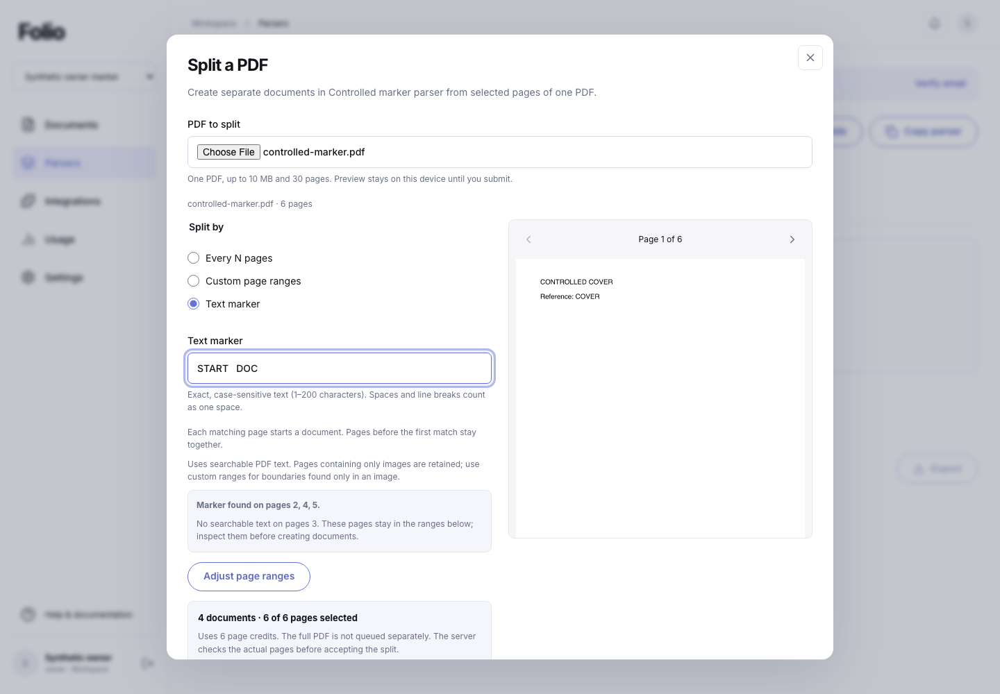
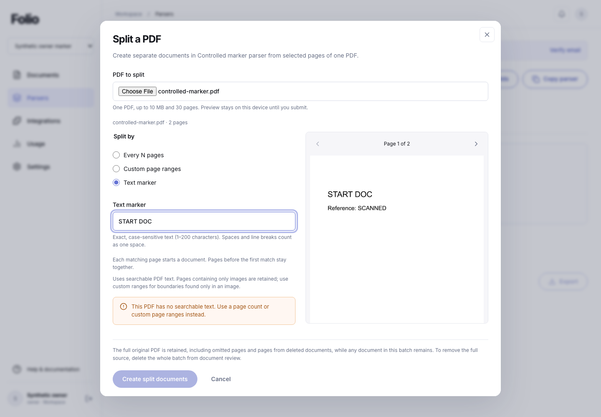
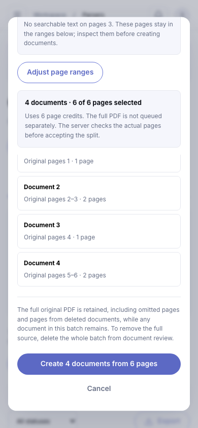
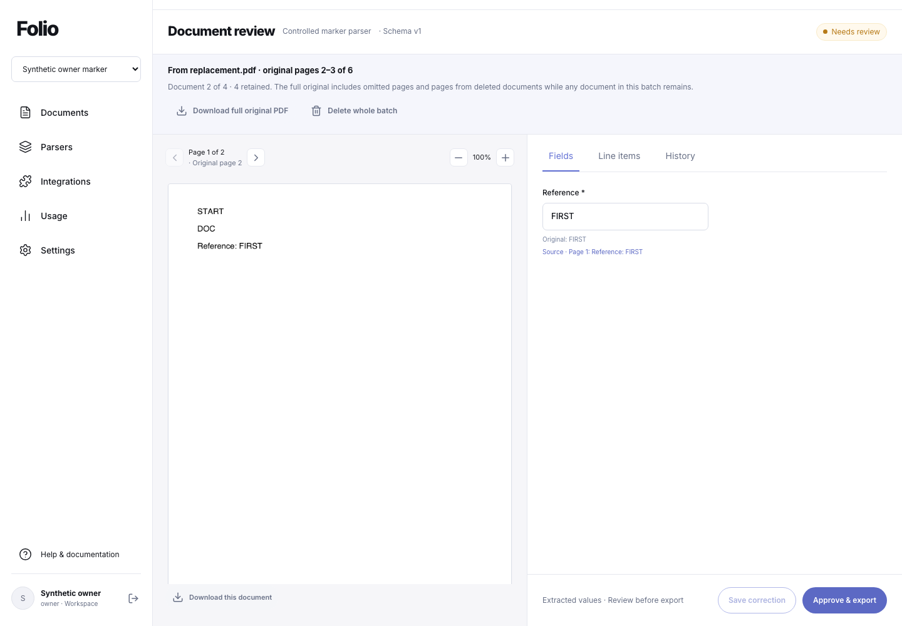
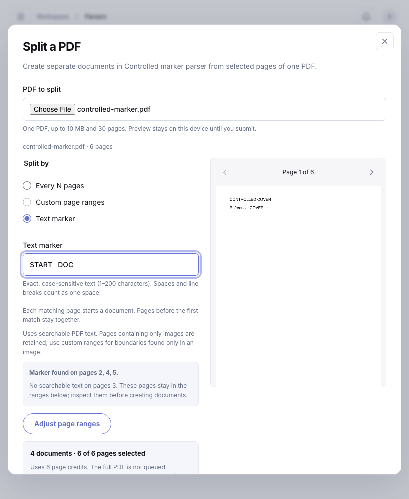

# PDF text-marker splitting

This increment adds native-text marker boundaries to the existing new-PDF split workflow. The controlled local verification below passed on the recorded source. Fixed page groups and custom page ranges retain their existing contract; the original 47 capability criteria remain unchanged. C10 also requires work beyond this increment: AI-selected boundaries, TIFF splitting, archive expansion, and resplitting or reversing existing documents.

## Boundary contract

A marker is literal, case-sensitive text containing 1–200 characters. Matching collapses consecutive whitespace and trims leading/trailing whitespace consistently in browser and server. It operates independently within each page's native PDF text. No OCR, regular expressions, fuzzy matching, cross-page matching or model request is introduced.

Every matching page begins a child and belongs to that child. Page 1 always begins the first child; pages before a later first match form a prefix document. Multiple occurrences on one page produce a single boundary. Consecutive matching pages can produce one-page children. A single child is valid. No match or no searchable text produces an actionable error. Pages without searchable text remain included, and the preview identifies them so the user can check boundaries visually.

Marker mode includes all source pages exactly once and charges the source page count. The user can convert the proposed ranges to custom ranges to make deliberate adjustments or omissions. Existing limits remain: source up to 10 MiB/30 pages, at most 20 children, 10 MiB per child and 20 MiB combined, subject to workspace limits; no silent dropped page or child. The decoder text limit remains 2 MiB.

## Confirmation, recovery and isolation

Marker requests bind `{mode:"marker",marker,ranges}` to the request UUID, parser and exact source bytes. The browser confirms the proposed ranges; the server decodes the actual PDF and independently recomputes native-text boundaries before storage, document/job creation or page charging. A disagreeing plan is rejected. Independent parent/intake/receipt validation still checks complete ordered ranges rather than trusting the preview.

The full original remains byte-preserved. Each child has its own PDF, processing job, review history, explicit approval and exports, with source-page lineage. Existing accepted/rejected request replay, quota races, atomic acceptance, lost-response recovery, signed-upload recovery and deleted-child receipt behavior remain requirements.

Saved request data contains the canonical marker and ranges for recovery, not PDF bytes or signed upload URLs. Marker text is carried in bounded decoder input rather than process arguments. Fixed public error messages and durable rejection codes avoid reflecting source text. Migration 031 adds the new permitted rejection reasons to the existing receipt constraint; it does not change tenant policy or existing receipt identities.

## Verification

Native-text marker PDF splitting is locally verified: **555/555 tests** passed on **Node 24.13.0** in **155.618 seconds**, with no failures, skips or cancellations. **Nine desktop/mobile workflow groups** and **five tablet preview/control groups** passed at **1440×1000, 390×844 and 820×1000**. Build, hosted packaging and isolated runtime checks passed on the same **252 source files**, fingerprint **`a54d0bdf296ef723d1b3f8226ce16ef2d12fe5b4569db1e71927e174e25c551c`**. Four actual deterministic rules jobs produced independently reviewed/approved downloads; six page credits remained unchanged after lost-response recovery. No real provider calls occurred. Both owned test accounts/workspaces and four child documents were cleaned across the two browser runs. Local migration **031** is applied (22 local migrations); hosted **021–031** and matching runtime activation remain pending. Free plans and mocked billing are unchanged; all 47 original capability criteria remain intact.

[Dated evidence](evidence/pdf-marker-2026-09-19/verification.json) · [Source manifest](evidence/pdf-marker-2026-09-19/source-manifest.json).

The focused backend checks passed **17/17 decoder/planner/IPC cases** in **19.853 seconds** and **19/19 intake cases** in **22.807 seconds**. The first contains real generated PDFs and actual decoder processes; the second verifies durable marker errors, exact lineage, tenant/origin protection, canonical replay without decoding/writing/charging again, signed-upload recovery at the final credit and retryable adapter disagreement. Existing fixed/custom splitting, cleanup and quota tests remain in the full suite.

The main Chromium browser run lasted **12.970 seconds** (21:48:09.087–21:48:22.057 UTC) and used the real local application, a six-page PDF, one raster-only marker page and deterministic text-anchor processing. Expected boundaries were **1; 2–3; 4; 5–6**. All four child PDFs had the expected page counts, every full-original download matched the source SHA, and each explicit approval produced exact JSON for its own document/run/approval. Marker-to-custom conversion showed an omitted cover reducing the preview from six credits to five; that edited preview was not submitted. The marker split used six credits and recovered after a deliberately lost accepted response without a second batch.

The separate **3.439-second** tablet supplement (21:52:25.645–21:52:29.084 UTC) verifies five local preview/control groups at 820×1000, including native/image distinction, edited ranges/credits, keyboard page navigation and create readiness. It submits no split. Main and tablet sources match the final manifest and built index. All 19 retained frames were individually reviewed; no visual blocker or whole-page horizontal overflow was found. Browser page identity, meaningful content, framework-overlay absence, console health and actual interactions passed. Main-run console events were the expected initial 404, deliberately dropped response and forced 503 lookup; the tablet run had none.

Independent checks add **2,367 pure cases**, **19 mocked envelope/client checks**, **two actual StrictMode response orders** and **nine actual PdfCanvas lifecycle cases**. These are separate evidence layers and are not added to the 555-test or browser group counts.

The packaged check performed actual marker splitting and rejected a forged confirmed range. The compiled decoder heap remains 192 MiB; source/TSX execution remains 256 MiB for loader overhead. This is a resource boundary, not an operating-system sandbox.

## Findings and recovery checks

Independent mounted-component testing reproduced a stale PDF preview callback: old native text could reach the replacement selection before passive cleanup. PDF loading, rendering and native-text operations now clean up at layout commit, with callback refs updated in the same lifecycle. The original reproduction and nine further readiness/render/text/error cases pass on the final component. Both response orders in the actual StrictMode pending-receipt flow also pass: only the current receipt applies and the dialog leaves its busy state. These controlled component tests are separate from the application browser run.

The first focused intake run passed 17/19 because two new test queries used the nonexistent audit column `details`. The queries now use `metadata`; the corrected 19/19 pass and original failure log are retained. No product change was needed for that test error. Two early browser attempts stopped at harness errors: a textbox locator included its hint, and an upload interceptor expected HTTP 201 rather than the endpoint’s HTTP 202. The latter stopped after acceptance; guarded recovery cleaned the exact owned account/workspace and four children, verified none remained, and retained the receipt. The completed final run uses contained route errors and DB-counted cleanup.

The known-secret comparison checked 753 tracked/nonignored files against 12 known values and found no matches. This is a bounded comparison, not a general secret-detection guarantee.

## Release boundary

Hosted migrations **021–031** and their matching runtime activation remain pending. This increment makes no hosted database/provider mutation, plan upgrade or real payment call. Free plans and visibly mocked billing remain. Local controlled tests, GitHub CI, preview deployment, canonical runtime, actual external delivery and customer use remain separate evidence layers.
