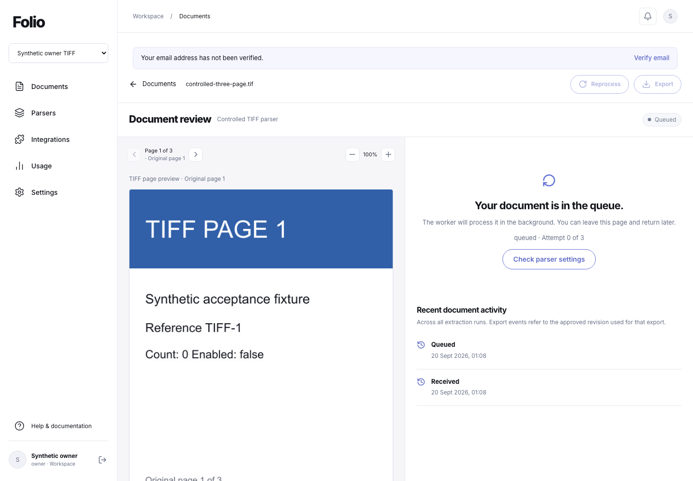
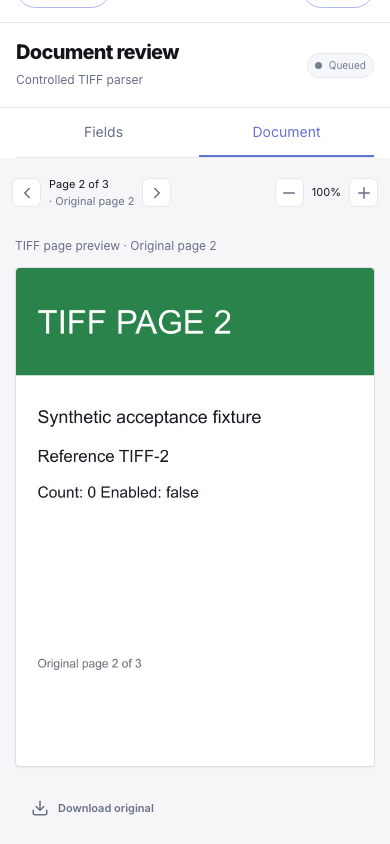
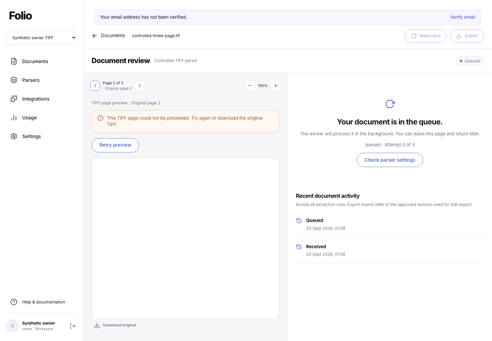

# TIFF intake and page review

TIFF is an additional C09 source format. A single- or multipage TIFF remains one document, with its original bytes, SHA-256 and `image/tiff` MIME type preserved. Each main image directory becomes one page in its original order. This increment does not implement TIFF splitting or close the other C09/C10 format criteria.

## Intake, review and extraction

The file chooser accepts `.tif` and `.tiff`. Detection uses actual binary signatures, including classic TIFF and BigTIFF in either byte order; renaming a file cannot bypass the parser's allowed-format policy. Ordinary uploads, authenticated multipart API submissions, signed-upload finalization and selected ZIP leaves use the same TIFF source inspection. Each accepted TIFF contributes its actual page count to existing workspace limits and once-only upload metering. HTTP 202 remains receipt for asynchronous processing, not successful extraction.

Intake checks the supported directory graph and fully decodes every main page before accepting the source. A later corrupt page cannot be hidden by a successful first-page preview. Main pages can have different dimensions and orientations. Auxiliary SubIFD, EXIF, GPS and interoperability directories are checked for safe references and actual cycles; shared metadata is allowed. Auxiliary images count toward the pixel budget but do not become extra document pages.

The review pane requests one temporary JPEG through `GET /api/documents/:id/preview?page=1`. It labels the image as a TIFF page preview and retains the original page number. Previous/next page, zoom, loading, error/retry and original download use the existing review controls. The preview endpoint requires `documents:read`, verifies the stored original hash, and rechecks authentication, membership and document lifetime after conversion. Responses use private/no-store caching and do not expose a public storage URL. Controlled tests cover deletion, revoked access and a changed original while work is in flight; this is evidence for the implemented rechecks, not an atomic guarantee against every change after the final check.

The client aborts old requests when the page, document or account/workspace changes. It decodes the JPEG before displaying it and rejects late image errors from an obsolete request. Retrying a failed preview moves keyboard focus to the stable preview section before replacing the retry control with loading status. The final browser evidence below covers held responses, held image decoding, page changes and workspace replacement.

AI extraction and field suggestions receive a temporary PDF containing one rendered image per original TIFF page, in the same order. The original TIFF bytes and MIME type remain in the provider input; the derivative is an additional, hash-bound visual input. Successful runs/suggestions retain the rendering version and settings in their usage metadata. Evidence page numbers refer to the original TIFF pages. Visual quotes still carry the existing independently-unverified visual-evidence warning; this conversion does not create native text, coordinates or confidence estimates.

Text-anchor mode and an unconfigured AI provider retain their explicit image/provider-required failure behavior. They do not invent OCR text. Corrections, approval, reprocessing and pinned CSV/XLSX/JSON export retain existing semantics. Original download returns the TIFF, not its temporary JPEG/PDF derivative. Derivatives are not persisted as additional storage objects, accepted documents or billable uploads.

## Encoding and resource boundaries

The current renderer is `folio-tiff-jpeg2048-q90-v1`. It fully decodes a selected page, composites transparency against white, converts colour to RGB8, applies that page's orientation, and resizes within a 2,048-pixel square without enlarging small pages. JPEG uses quality 90 and 4:4:4 chroma sampling. Review and AI therefore use resized, lossy derivatives; download the unchanged original when fine detail matters.

| Boundary | Limit |
|---|---|
| Original file | 10 MiB; workspace limits can be lower |
| Main pages | 30 |
| Image pixels | 40 million per image; 300 million across checked images |
| Channels and sample depth | At most four channels; integer samples of 1, 2, 4, 8 or 16 bits |
| Declared decoded image / materialized page buffer | 160 MiB; large tile geometry is bounded separately |
| Directory graph | 256 IFDs, at most 1,024 entries per IFD |
| Image data blocks | 100,000 strips/tiles across checked images |
| JPEG derivative | 2 MiB per page |
| Complete AI PDF | 10 MiB, including its PDF container |
| Decoder response | 4 MiB for source/page JSON; 14 MiB for base64 PDF JSON |
| Isolated decoder | Two concurrent children, 30-second termination deadline; 192 MiB compiled V8 heap or 256 MiB with the source/TSX loader |

The structural parser bounds 64-bit values before converting them to JavaScript numbers. It checks field types/counts, directory and value extents, data extents, page dimensions, strip/tile geometry, cycles, overlapping directories and image blocks overlapping directory structures. Word-aligned BigTIFF directories/values are accepted because the installed libtiff writer produces them; this does not relax range, integer or overlap checks.

Verified small encoding fixtures include uncompressed RGB, LZW, PackBits, Deflate, JPEG and one-bit CCITT Group 4; strips and tiles; 8/16-bit RGB/RGBA; both byte orders; classic TIFF and BigTIFF; and all eight orientations. This is evidence for those tested encodings, not every TIFF extension or codec. Floating-point samples, more than four channels, unsupported sample depths and inputs exceeding limits are unavailable. The native library can reject further unsupported or damaged inputs.

The process heap setting is not a total-memory, native-allocation or operating-system sandbox guarantee. These tests do not establish production throughput, distributed load capacity or host-level filesystem/network isolation.

## ZIP imports and failure classification

ZIP preview and confirmation share one **300-million-pixel TIFF budget across the archive**. The complete catalogue examines eligible leaves, so this budget includes structurally valid TIFFs that are later deselected. It is checked before native document decoding. Existing compressed/expanded ZIP, entry, Office, text, document and workspace limits also apply. A selection cannot bypass this aggregate work bound; exceeding it rejects the operation without partial acceptance. This does not promise that every combination of 20 documents or 600 pages will fit the TIFF work/output limits.

Explicit structural/policy failures produce fixed typed reasons. Ordinary intake retains the existing byte/parser-bound rejection receipt with no accepted document, processing job, upload charge or accepted original. Structurally invalid ZIP leaves remain visibly unavailable; an archive-wide TIFF pixel excess rejects the whole operation.

Sharp does not expose a reliable typed invalid-input exception for every native pixel-decoding failure. Untyped native failures, missing dependencies, invalid subprocess responses and resource interruptions remain operational errors rather than permanent rejection records. A fixture with a corrupt second-page Deflate stream can preview its valid first page, but full inspection, AI conversion and second-page preview fail without acceptance. No native diagnostic is returned as customer-facing copy. Retrying cannot make an invalid file valid; the original can be re-exported to a smaller supported TIFF or PDF.

## Reproduced defects and corrections

Independent pixel tests found that the initial manual rotation/flip sequence swapped orientations 5 and 7. The corrected sequence passes six-cell pixel-position assertions for all eight orientations, rather than only comparing image dimensions.

A second fixture found that strict eight-byte alignment rejected small tiled BigTIFFs written by Sharp/libtiff itself. LZW, Deflate, JPEG and fax examples had word-aligned directory offsets. Accepting word alignment, with all other structural guards retained, makes those real writer outputs pass. The independent suite also compares each image embedded in the generated PDF byte-for-byte with the corresponding isolated page preview.

## Verification status

The independent [adversarial test suite](../tests/tiff-adversarial.test.ts) passed **14/14 groups** on Node **24.13.0** in **6.913 seconds** at the recorded checkpoint. The final combined [decoder](../tests/tiff-decoder.test.ts) and adversarial run passed **22/22 cases** in **11.925 seconds**, with no failures or skips. TypeScript and whitespace/diff checks passed. These checks use synthetic in-memory files, native image decoding, isolated child processes and local PDF inspection; no database or external provider was used by them. The combined run includes exact-300-million-pixel versus excess-pixel ZIP preflight, including an unselected TIFF leaf.

[Decoder, adversarial and resource receipt](evidence/tiff-intake-2026-09-20/decoder-adversarial-resource.json) and the [evidence index](evidence/tiff-intake-2026-09-20/README.md) separate focused checks from the combined verification. A 30-page, 300-million-pixel isolated source-mode fixture produced a 3,981,862-byte PDF in 1.824 seconds; a denser fixture with the same page/pixel count rejected at the derived-output limit in 1.365 seconds. Both use synthetic 2,500×4,000 images shared by 30 main IFDs, with every page fully decoded. Those initial observations used the source-mode 256 MiB V8 heap. The same accepted 255,578-byte fixture then passed the current compiled child with **192 MiB V8 heap and no TSX loader** in **2.596 seconds**; the resulting **3,981,862-byte PDF** was loaded and its **30 pages** verified. No timeout occurred, compiled files remained unchanged and maximum native RSS was not measured.

The final-source intake/API checkpoint passed **6/6 cases** in **7.212 seconds**, covering both controlled AI worker paths, signed/ZIP intake, replay and page charges, rejection without accepted data, and preview revocation/deletion/original-corruption checks. The complete serial suite passed **641/641 tests** in **209.386 seconds**, with no failures, skips or cancellations. Build (**1.7455 seconds**), hosted packaging (**5.1855 seconds**) and isolated bundle verification (**9.3216 seconds**) passed with unchanged source. The bundle checks include actual classic/BigTIFF previews and ordered PDF conversion. The current-migration backup/restore regression passed **11 groups and 13 restored-runtime assertions** in **13.684 seconds**. The frozen source manifest covers **288 files**, fingerprint **`13f315c6092c88f57dd7e78b05309ac3dd500fdf784ab33c6b53059ac1d9e6bd`**. [Combined verification](evidence/tiff-intake-2026-09-20/verification.json) · [Backup regression](evidence/tiff-intake-2026-09-20/backup-regression.json).

The final [browser acceptance](evidence/tiff-intake-2026-09-20/browser-verification.json) passed **10/10 groups** in **17.465 seconds** at **1440×1000, 820×1000 and 390×844**, on the same unchanged source. Thirteen final frames were individually inspected, with seven published. A real three-page TIFF completed preview/navigation/zoom, safe failure/retry, keyboard focus, held-response and image-decode cancellation, workspace replacement, controlled extraction, correction, explicit approval, exact CSV/XLSX/JSON exports and unchanged original download. Viewer access, tenant denial and existing PNG/PDF previews/downloads also passed. One controlled extraction ran; zero real provider calls occurred. Three owned accounts, workspaces and documents were cleaned. Expected test-injected 503 and scope-denial 404 responses are explained in the receipt; there were no unexpected console or page errors.

These results establish the recorded local TIFF workflow. Pull-request CI is tracked by the checks on its exact commit, rather than inferred from this dated local acceptance receipt.

Migration **033** is applied locally (24 applied migrations) and extends parser-format and durable receipt constraints. Hosted **021–033** and a matching runtime remain pending. The existing free plans and mocked billing remain unchanged. No new real AI request, email delivery, hosted deployment, broad OCR accuracy, production readiness or customer use is established here. Other C09 converters, C10 TIFF splitting and the remaining original 47-capability criteria stay open.
