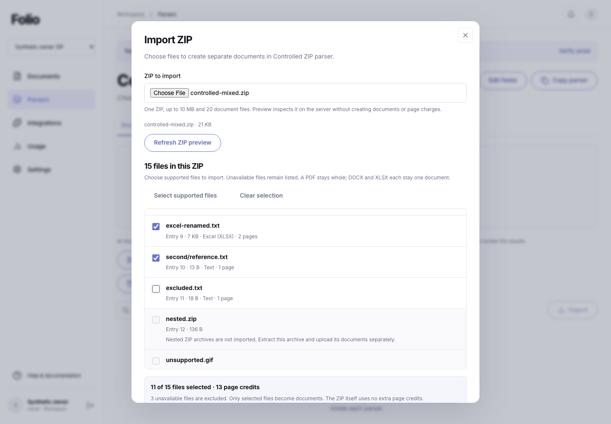
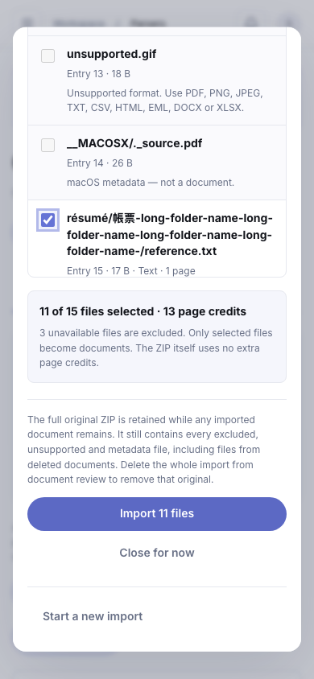
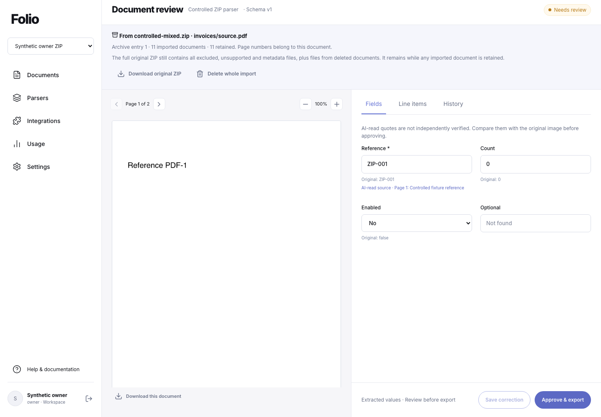
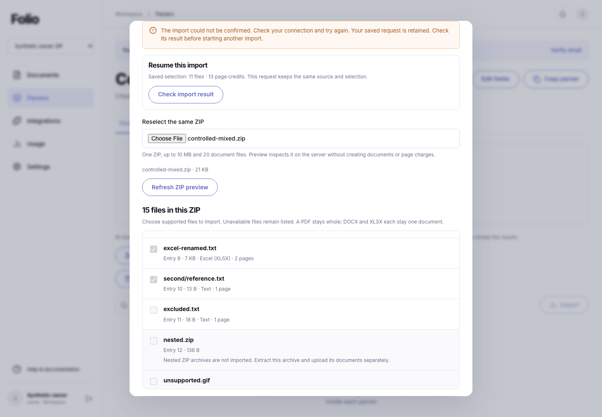

# ZIP document imports

ZIP import previews the files in one archive and creates an independent document for each selected supported file. The full ZIP and the selected leaf bytes are retained unchanged. Original central-directory indices and relative paths provide lineage; page references stay local to each document. This extends C10 while preserving all 47 original capability criteria.

## Selection and processing

Use **Import ZIP** in a ready parser, select one ZIP, and request a server preview. The preview lists regular files with their detected format, size, page count and availability. Supported files are selected initially; users can deselect them. Unsupported content and recognized macOS metadata remain visible with reasons. Real documents whose names start with `._` remain selectable; metadata classification also checks actual file signatures.

Preview creates no documents, processing jobs, accepted originals or page charges. Signed storage can hold a temporary staging copy, which expires through the normal cleanup lane. Before import, the interface shows selected document/page totals and explains that the original archive retains excluded files.

Each selected PDF stays a whole PDF; existing PDF splitting remains a separate operation. DOCX and XLSX packages remain atomic documents. Plain nested ZIPs are unavailable for selection. The nine existing detected document formats retain their existing text, page and image behavior; ZIP import adds no OCR or provider capability.

Actual selected pages are charged once at atomic acceptance, subject to current workspace limits. The ZIP is not queued or charged as an extra document. Each child follows existing processing, review, correction, explicit approval and pinned-export workflows. HTTP 202 means the documents were accepted for processing, not that extraction or approval has completed.

## Source identity, atomic acceptance and recovery

The canonical selection is `{mode:"zip",version:1,sourceSha256,entries}`. `entries` contains 1–20 distinct increasing, one-based central-directory record indices. Directory records can create gaps. The request UUID, workspace, parser, exact ZIP digest and canonical selection identify one immutable operation. The decoder rebuilds the manifest from the actual bytes and verifies the selected files before acceptance; browser preview values are not authority to change source content or page counts.

Acceptance reserves tracked private source/child objects, then rechecks parser readiness, current schema/configuration, allowed formats, actual quota, write intents and any direct-upload lease. One transaction commits the batch receipt, child manifest, documents, jobs, usage and audit events. A rejection or rollback creates no partial accepted batch. Retrying an accepted request returns its existing identities without new jobs, documents or charges. Deleted children remain unavailable in that receipt rather than being recreated. A new request is a separate charged import.

The browser keeps only scoped request/digest/selection/recovery metadata in session storage. It does not persist archive bytes, file paths or signed URLs there. Account/workspace/parser changes and delayed preview responses invalidate the active view. The original source and selection are required to resume an uncertain import; the receipt is checked before reattempting acceptance.

## API contract

| Method | Route | Behavior |
|---|---|---|
| POST | `/api/parsers/:id/archive-imports/preview` | Multipart `file` and UUID `requestId`; returns source-bound file manifest and available page total. |
| POST | `/api/parsers/:id/archive-imports` | Multipart `file`, `requestId`, and canonical JSON `options`; returns HTTP 202 batch receipt. |
| GET | `/api/parsers/:id/archive-imports/requests/:requestId` | Recover the existing receipt, including deleted-child availability. |
| POST | `/api/parsers/:id/uploads` | Existing signed reservation accepts `archiveImport:{requestId,options?}`; mutually exclusive with `pdfSplit`. |
| POST | `/api/uploads/:id/archive-preview` | Preview one live, owned staging reservation; verifies actual length and digest. |
| POST | `/api/uploads/:id/archive-confirm` | `{options}` binds one immutable selection before finalization. |
| POST | `/api/uploads/:id/finalize` | Finalizes the stored operation; an unconfirmed archive reservation cannot become an ordinary upload. |
| GET | `/api/documents/:id/archive-original` or `/archive-original-url` | Obtain the full original ZIP through a retained, owned child. |
| DELETE | `/api/archive-imports/:id` | Remove retained children and queue source/child storage deletion; report pending, failed or complete cleanup. |

Preview/import/confirmation/deletion require an owner, administrator or editor and `documents:write`; receipt/source reads require `documents:read`. Normal origin/session/API-key checks and forced tenant RLS apply. Migration 032 adds archive batch/entry records and extends direct-upload, object-reference, deduplication and retention integration.

## Resource and format boundaries

The compressed ZIP is limited to 10 MiB, 20 document files, 256 total file/folder records and 1,024 UTF-8 bytes per relative path. Recognized macOS metadata does not count as a document, but all records count toward metadata and expansion limits. Each leaf is at most 10 MiB and 30 pages/sheets; combined outer expansion is at most 20 MiB and decoded text at most 2 MiB. Actual inner Office expansion shares one 40 MiB budget across all Office leaves. Workspace limits can be lower. Limits reject the operation rather than silently truncating it.

The reader checks all outer records, including excluded files, before accepting selected documents. It validates CRC32, actual expanded length, complete compressed-stream consumption, physical record coverage, signed/unsigned data descriptors, local/central agreement and safe distinct relative paths. STORE and DEFLATE are supported. Encryption, ZIP64, multidisk archives, unsafe paths, links/special files, duplicate aliases, overlaps and trailing compressed streams are rejected. Structurally corrupt inner ZIP/Office records also reject the container; semantically incomplete Office documents are displayed as unavailable.

Format checks follow the [ZIP specification](https://pkware.cachefly.net/webdocs/casestudies/APPNOTE.TXT); bounded inflation uses the runtime's [zlib facilities](https://nodejs.org/docs/latest-v24.x/api/zlib.html). Archive-controlled paths never become filesystem or storage keys.

The operation shares the existing two decoder slots, 30-second kill deadline and 192 MiB compiled V8 heap; source/TSX execution uses 256 MiB. Archive and PDF batch writes share the same two active batch-attempt allowance and 250 MiB temporary-storage budget. Failed or uncertain writes retain byte reservations until physical deletion is confirmed. These are application/process resource bounds, not an operating-system sandbox or total-memory guarantee.

## Retention

Deleting one child removes its current content and private lineage path/name, while minimal identity/usage tombstones remain. The original ZIP—including excluded files and bytes belonging to deleted children—remains accessible through any retained child. Removing the last child or deleting the batch releases the full source and queues physical cleanup. A queued deletion is not proof that the storage object is already gone.

## Verification and release

Selective ZIP imports pass **594/594 serial tests** on **Node 24.13.0** in **184.942 seconds**, with no failures, skips or cancellations. **11/11 desktop/tablet/mobile browser groups** pass at **1440×1000, 820×1000 and 390×844**. Build, hosted packaging and isolated runtime checks pass on the same **266 source files**, fingerprint **`c454e4cb64e1034183db4dd3cc16aae59fff59b25704e3fd6be2a0a3de5f17fc`**. Eleven selected children across nine existing formats were processed with controlled extraction, independently reviewed/approved and exported; the full original and every selected leaf matched their source bytes. Interrupted multipart and signed-transfer recovery preserved request/selection identity and page charges. Signed storage was controlled local transport, with acceptance only for that child. Twelve controlled extraction calls and zero real provider calls occurred. Both owned accounts/workspaces and all remaining fixture documents were cleaned. Local migration **032** is applied (23 local migrations); hosted **021–032** and matching runtime activation remain pending. Free plans and mocked billing are unchanged; all 47 original capability criteria remain preserved. [Machine-readable receipt](evidence/zip-import-2026-09-19/verification.json) and [source manifest](evidence/zip-import-2026-09-19/source-manifest.json).

The full suite includes **20 decoder/adversarial cases** and **19 persistence/API cases** for ZIP imports. An earlier independent scanner/decoder corpus passed 79 grouped checks, including 2,000 deterministic mutations; those mutations are not additional Node test cases. The packaged 192 MiB decoder separately passed 20 mixed documents, 20 MiB of expanded image bytes and 600 actual PDF pages. The final browser run captured 20 frames with no unexpected console errors or page errors. Each of the 11 main children passed approved JSON export; the first also passed typed CSV/XLSX exports. A separate existing-PDF split passed processing, approval and export without duplicated lineage.

Review corrected structural inner-Office rejection, filename-only macOS metadata classification and outer-filename-dependent ZIP identity. Shared storage accounting now holds expired staging objects in the byte/object budget until physical deletion succeeds. Browser polling exposed duplicate origin panels caused by shared sibling keys; component-specific keys fix that defect. Failed-import guidance is brought into view and preserves the saved request and selection.

The first browser fixture exceeded the free plan's one-parser allowance; the harness now uses one parser in each of two owned test workspaces. Failed browser attempts and their cleanup remain recorded, including explicit cleanup after a pending download waiter interrupted teardown. A strict error-position assertion was investigated separately from the visible workflow. An initial full-suite attempt could not connect to the local PostgreSQL socket (`EPERM`); final acceptance uses the guarded local database access. None of these failed attempts is counted as a passing acceptance run.

Hosted migration 032 and the earlier unapplied migrations 021–031 require matching runtime activation. This work uses guarded local fixtures and controlled transports; no paid-plan change or real payment call is introduced. Canonical deployment, external-provider behavior and customer use remain separate evidence. AI/TIFF splitting, existing-document resplitting/reversal and broader archive formats remain C10 gaps.
