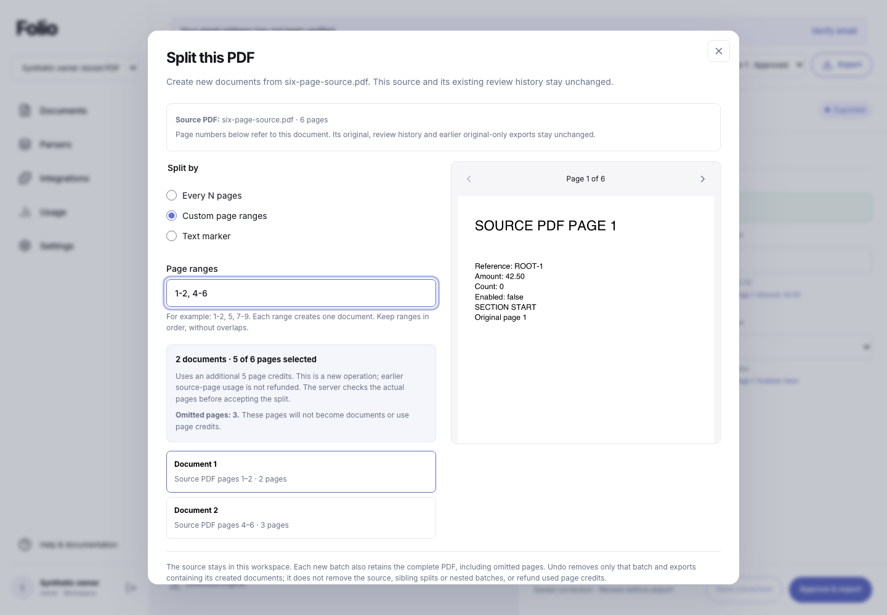
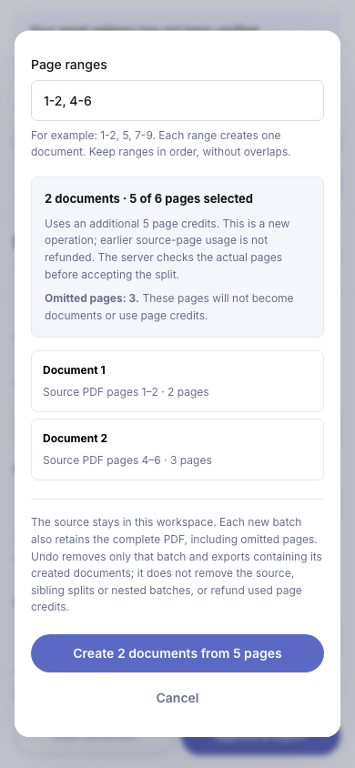
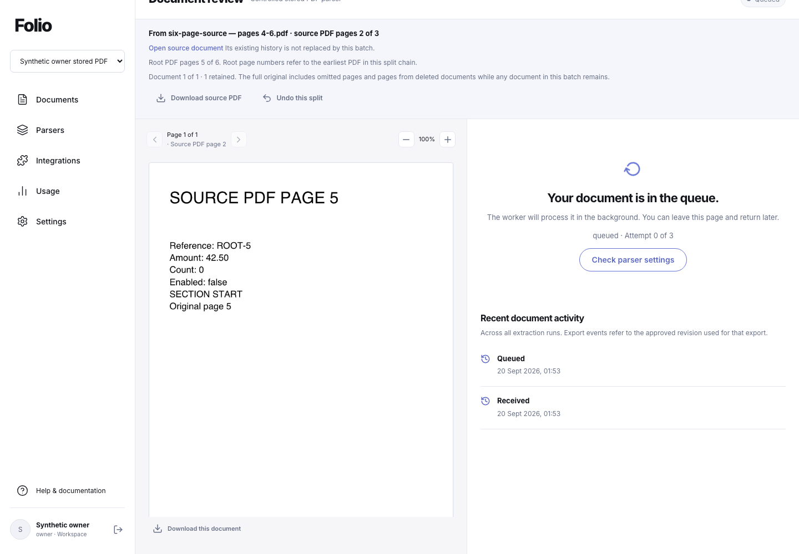
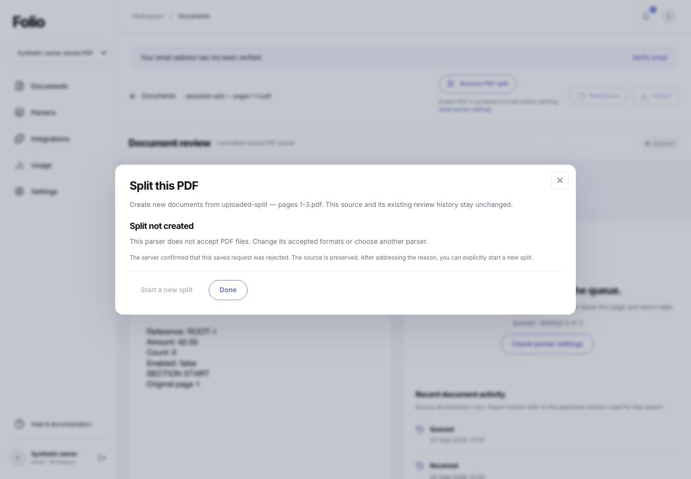

# Stored-PDF splitting evidence — 20 September 2026

[Combined verification](verification.json) records 669 passing serial tests, build/package/runtime checks, nine final browser groups and the updated independent restore drill on one unchanged 297-file source. [Source manifest](source-manifest.json) · [Test summary](tests-summary.txt) · [Browser acceptance and visual review](browser-verification.json) · [Backup regression](backup-regression.json).

The browser used the compiled app at `http://127.0.0.1:4337`, installed Playwright (Browser plugin unavailable), and 1440×1000, 820×1000 and 390×844 viewports. Generated PDFs use real native-text rules extraction. No extraction adapter or real provider supplies the values. Three owned accounts/workspaces and eight remaining documents were cleaned. The source remained unchanged.

| Check | Result |
|---|---|
| Page identity and meaningful content | Pass: Folio title, parser/review headings and real document controls |
| Framework overlay | Pass: none observed |
| Console and page errors | Pass: zero unexpected console or page errors; intentional recovery/policy/scope responses individually explained in the browser receipt |
| Rendered layout | Pass: all 16 current frames inspected, no whole-page overflow; 11 selected frames published |
| Actual interaction | Pass: stored split, repeated/lost-response recovery, child review/export, nested split and undo, terminal rejection/new request, workspace/viewer boundaries |
| Immutable data | Pass: original database history and earlier export bytes unchanged; nested original and source-copy bytes survive ancestor undo |

The modal intentionally scrolls vertically, and mobile uses separate range and preview tabs. Backend tests separately cover mixed-export deletion, API/role/expiry races, quotas, rollback, read/decode/write interruption, immutable namespace binding and exact pagination. Earlier failed harness attempts are retained privately and summarized in the browser receipt. The dated local receipt does not imply hosted runtime activation or full Parseur parity; consult the pull request checks for CI on its exact commit.

